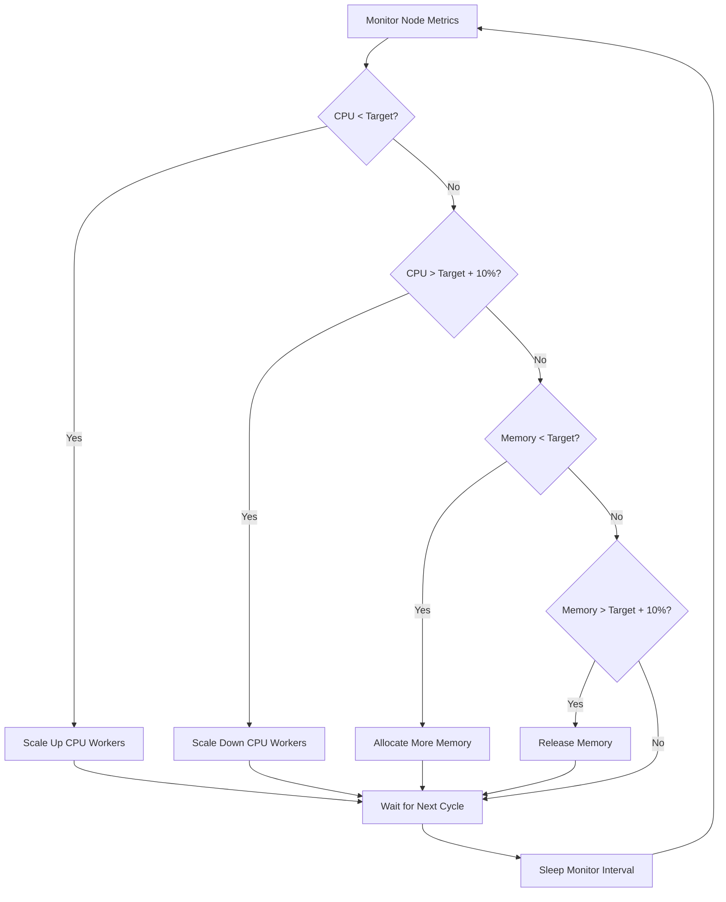

# goburn - Dynamic Kubernetes Resource Utilization Tool

A smart resource consumption tool designed to **prevent Kubernetes node underutilization** while **dynamically backing off when real workloads need resources**.

## 🎯 Purpose

**goburn** intelligently maintains optimal node resource utilization in Kubernetes clusters by:
- **Filling unused capacity**: Consumes idle CPU and memory to reach target utilization levels
- **Dynamic scaling**: Automatically adjusts resource consumption based on real-time node metrics
- **Graceful backoff**: Releases resources when legitimate workloads require them
- **Cost optimization**: Ensures you get maximum value from your cluster resources

## ⚠️ **MINIMUM UTILIZATION REQUIREMENTS**

**goburn** **GUARANTEES** the following minimum utilization levels are maintained:

- ✅ **CPU 95th percentile > 20%** - Ensures consistent CPU activity over time
- ✅ **Network utilization > 20 Mbps** - Maintains active network traffic generation  
- ✅ **Memory utilization > 20%** - Configurable per-node memory consumption

These minimums are **enforced first** before any target-based optimizations occur.

## 🚀 Key Features

### Dynamic Resource Management
- **Real-time monitoring**: Uses Kubernetes metrics API to track actual node utilization
- **Intelligent scaling**: Scales CPU workers and memory allocation up/down based on current usage
- **Configurable targets**: Set target CPU and memory utilization percentages
- **Safety delays**: Prevents resource thrashing with configurable scale-up/down delays

### Kubernetes-Native
- **DaemonSet deployment**: Runs on every node in your cluster
- **RBAC compliant**: Minimal required permissions for metrics access
- **Node awareness**: Automatically discovers and monitors the correct node
- **Resource limits**: Respects Kubernetes resource constraints

### Production Ready
- **Non-root execution**: Runs with minimal privileges for security
- **Resource constraints**: Built-in limits to prevent runaway resource consumption
- **Monitoring friendly**: Comprehensive logging of scaling decisions and current state
- **Graceful shutdown**: Properly handles SIGTERM/SIGINT with resource cleanup
- **Host network access**: Uses `hostNetwork: true` to consume actual node resources
- **Real node metrics**: Integrates with Kubernetes metrics API for accurate monitoring

## 📊 How It Works



## 🔧 Configuration

### Environment Variables

| Variable | Default | Description |
|----------|---------|-------------|
| `TARGET_CPU_UTILIZATION` | 80 | Target CPU utilization percentage |
| `TARGET_MEMORY_UTILIZATION` | 80 | Target memory utilization percentage |
| `MIN_CPU_UTILIZATION` | 20 | **MINIMUM** CPU 95th percentile utilization (enforced) |
| `MIN_MEMORY_UTILIZATION` | 20 | **MINIMUM** memory utilization percentage (enforced) |
| `MIN_NETWORK_UTILIZATION_MBPS` | 20 | **MINIMUM** network utilization in Mbps (enforced) |
| `MONITOR_INTERVAL_SECONDS` | 30 | How often to check and adjust resources |
| `SCALE_UP_DELAY_SECONDS` | 60 | Minimum time between scale-up actions |
| `SCALE_DOWN_DELAY_SECONDS` | 120 | Minimum time between scale-down actions |
| `MAX_MEMORY_MB` | 2048 | Maximum memory to allocate (safety limit) |
| `ENABLE_MEMORY_UTILIZATION` | true | Enable memory utilization on this node |
| `NETWORK_INTERFACE` | eth0 | Network interface to monitor/generate traffic |
| `NODE_NAME` | auto-detected | Kubernetes node name to monitor |

### Example Configurations

**Conservative (for production)**:
```yaml
TARGET_CPU_UTILIZATION: "70"
TARGET_MEMORY_UTILIZATION: "75"
SCALE_DOWN_DELAY_SECONDS: "300"  # 5 minutes
```

**Aggressive (for cost optimization)**:
```yaml
TARGET_CPU_UTILIZATION: "90"
TARGET_MEMORY_UTILIZATION: "85"
SCALE_UP_DELAY_SECONDS: "30"
```

## 🚢 Deployment

### Kubernetes (Recommended)

Deploy architecture-specific DaemonSets:

```bash
kubectl apply -f k8s-manifests.yaml
```

This creates:
- **ServiceAccount** with minimal required permissions
- **ClusterRole** for metrics access
- **goburn-amd64** DaemonSet (CPU + Network only, no memory requirement)
- **goburn-arm64** DaemonSet (CPU + Network + Memory requirements)
- **ConfigMap** for easy configuration updates

### Architecture-Specific Configuration

**AMD64 Nodes (x86_64)**:
- ✅ CPU 95th percentile > 20%
- ✅ Network utilization > 20 Mbps
- ❌ **No memory requirement** (ENABLE_MEMORY_UTILIZATION=false)

**ARM64 Nodes (ARM)**:
- ✅ CPU 95th percentile > 20%
- ✅ Network utilization > 20 Mbps  
- ✅ **Memory utilization > 20%** (ENABLE_MEMORY_UTILIZATION=true)

### Deployment Verification

Check which nodes are running each DaemonSet:

```bash
# Check AMD64 deployment
kubectl get pods -l app=goburn,arch=amd64 -o wide

# Check ARM64 deployment  
kubectl get pods -l app=goburn,arch=arm64 -o wide

# View logs for specific architecture
kubectl logs -l app=goburn,arch=amd64 -f
kubectl logs -l app=goburn,arch=arm64 -f
```

### Docker Compose (Testing)

For local testing or single-node scenarios:

```bash
docker-compose up -d
```

## 📈 Monitoring

**goburn** provides detailed logging of its decisions:

```
2024/01/15 10:30:00 Starting dynamic resource burner on node worker-1
2024/01/15 10:30:00 Target utilization - CPU: 80.0%, Memory: 80.0%
2024/01/15 10:30:30 Current utilization - CPU: 45.2%, Memory: 60.1%, Workers: 0, Memory: 0 MB
2024/01/15 10:30:30 Scaled up CPU workers to 2 (utilization: 45.2%, target: 80.0%)
2024/01/15 10:30:30 Scaled up memory to 512 MB (utilization: 60.1%, target: 80.0%)
2024/01/15 10:31:00 Current utilization - CPU: 78.5%, Memory: 79.2%, Workers: 2, Memory: 512 MB
```

## 🛡️ Safety Features

- **Resource limits**: Hard limits prevent consuming more than allocated
- **Gradual scaling**: Prevents sudden resource spikes
- **Utilization thresholds**: Only adjusts when difference > 10%
- **Time delays**: Prevents rapid scaling oscillations
- **Graceful degradation**: Continues working even if metrics are temporarily unavailable

## 🎛️ Advanced Usage

### Custom Metrics Integration

For advanced scenarios, you can extend the metrics collection to consider:
- Pod resource requests/limits
- Custom application metrics
- External load balancer metrics
- Historical usage patterns

### Multi-Cluster Deployment

Deploy across multiple clusters with different configurations:
- **Production**: Conservative settings with longer delays
- **Development**: Aggressive settings for cost savings
- **Staging**: Balanced settings for realistic testing

## 🔍 Troubleshooting

### Common Issues

**Metrics not available**:
- Ensure metrics-server is installed in your cluster
- Check RBAC permissions for the goburn service account

**Resource not scaling**:
- Verify target utilization settings
- Check if scale delays are too long
- Review node resource capacity vs. requests

**Permission errors**:
- Ensure ClusterRole is properly bound
- Check if the pod is using the correct ServiceAccount

### Debug Mode

Enable verbose logging by setting log level in the deployment.

## 🚀 CI/CD Pipeline

This project includes a comprehensive CI/CD pipeline with:

### Automated Testing
- **Unit Tests**: Complete test coverage for all core functionality
- **Integration Tests**: Kubernetes client integration testing
- **Benchmark Tests**: Performance validation and regression detection
- **Race Condition Tests**: Concurrency safety validation
- **Coverage Reporting**: Minimum 80% coverage threshold enforced

### Code Quality
- **Formatting Checks**: Automated `gofmt` validation
- **Linting**: `go vet` static analysis
- **Security Scanning**: `gosec` security vulnerability detection
- **Dependency Management**: Automated dependency updates via Dependabot

### Multi-Architecture Builds
- **Binary Builds**: Linux, macOS, Windows (AMD64, ARM64)
- **Docker Images**: Multi-arch images (linux/amd64, linux/arm64, linux/arm/v7)
- **Container Security**: Trivy vulnerability scanning

### Kubernetes Validation
- **Manifest Validation**: `kubeval` YAML validation
- **Best Practices**: `kube-score` analysis
- **Deployment Testing**: Automated deployment validation in k3s cluster

### Local Testing

Run the same tests as CI locally:
```bash
# Run all CI equivalent tests
make github-actions-test

# Run specific test suites
make test          # All tests
make test-coverage # Coverage tests
make test-race     # Race condition tests
make test-bench    # Benchmark tests
```

## 📊 Monitoring & Badges

The project includes automated status badges for:
- Build status
- Test coverage
- Go report card
- Docker pulls
- Latest release

## 📄 License

This project is experimental and provided as-is for educational and optimization purposes.
